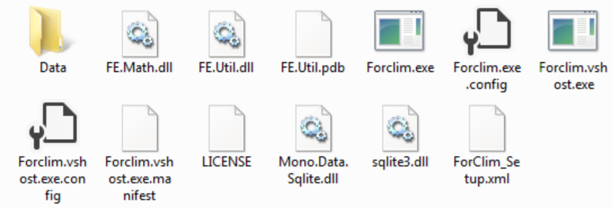
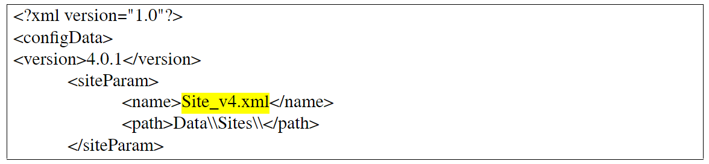

# FORCLIM Guía de Usuario v4.0

***

### Livia Rasche
### Enero 2010

#### _Revisado en noviembre de 2011_

#### _Revisado en enero de 2012 por Alvaro G. Gutierrez_

#### _Revisado en agosto 2019 por Nica Huber_

#### _Traducido en junio del 2021 por el equipo de Modeladores del Laboratorio de Dinámica de la Vegetación, Universidad de Chile_

## Tabla de contenidos

1. Introducción

2. Distribución e Instalación

3. La configuración de ForClim

+ 3.1. Concepto de simulaciones Forclim

+ 3.2. Un mini-tutorial

- - ¿Qué ocurre en la puesta en marcha de ForClim?

- - Realización de un experimento de simulación

- - Después de la simulación: los archivos de resultados

+ 3.3	Species File

+ 3.4	Site File

+ 3.5	Trabajar con escenarios de cambio climático

+ 3.6	Trabajar con series temporales meteorológicas

+ 3.7	Inicialización con Stand data (datos de rodal)

- -  Inicialización con datos de inventario

- -   Inicialización con datos de simulación

+ 3.8	Trabajando con escenarios de manejo

+ 3.8.1 Definiendo las operaciones

+ 3.8.2 Ajustando los tipos de cosechas

+ 3.8.3 Descripción detallada de los kType seleccionados

4. Referencias

***

## 1. Introducción

Esta Guía de Usuario describe cómo instalar, configurar y usar la aplicación de consola del modelo de simulación ForClim v4.0 (Bugmann 1996, Huber et al. in prep., Huber et al. under revision).
Detalles sobre los supuestos y ecuaciones del modelo se encuentran disponibles en la Documentación de ForClim.

## 2.	Distribución e instalación

ForClim se distribuye como un archivo .exe. Junto con la aplicación, se entregan algunos archivos .dll, un archivo .xml “ForClim_Setup” y una carpeta adicional “Data” . El directorio “Data” contiene las carpetas “Climate”, “Management”, “Sites”, “Species”, “States” y “Weather”. Esta última sólo es relevante si se aplican series temporales meteorológicas. Después de copiar el directorio en su disco duro, el modelo está totalmente operativo.

Si usted está trabajando con Mac o usa Linux, adicionalmente necesita instalar el marco de desarrollo de código abierto .NET “Mono”. Para esto diríjase a www.mono-project.com y descargue la última versión de Mono e instálela en su computadora. 

Fig. 1: Para que ForClim funcione correctamente, el directorio ForClim debe contener los archivos ForClim.exe, ForClim_Setup.xml, cuatro archivos .dll, la carpeta "Data" y algunos otros archivos.

## 3.	La configuración de ForClim

### 3.1	Concepto de simulaciones Forclim

ForClim utiliza dos unidades fundamentales en las que se basan las simulaciones: En primer lugar, está el concepto de sitio para el que se ejecuta una simulación, y en segundo lugar, está el concepto de lista de especies sobre las que se realizan los cálculos, dada la información del sitio. En consecuencia, ForClim distingue dos tipos básicos de archivos de entrada: site files y species files (convención de nomenclatura: *.xml). En la carpeta “Data” se encuentra un archivo por defecto para cada uno de estos tipos.

En una ejecución de simulación, es necesario definir un sitio y un conjunto de especies, y especificar el periodo de inicio, el periodo de finalización y el intervalo de control de la ejecución de simulación.

### 3.2	Un pequeño tutorial

#### ¿Qué ocurre en la puesta en marcha de ForClim?
Cuando se hace doble clic en la aplicación ForClim (el archivo .exe), se carga el código del modelo ForClim y se lee la configuración del experimento desde el archivo ForClim_Setup.xml que debe estar almacenado en el mismo directorio que el archivo .exe. Si no es así, se mostrará un mensaje de error.

#### Realización de un experimento de simulación
#### _Preparación del Setup.xml_
Para ejecutar un experimento de simulación con ForClim, el Setup file ForClim_Setup.xml primero debe ser preparado. 

En este archivo, se registran todos los ajustes básicos del experimento de simulación, así como el nombre y la ubicación de los archivos del sitio y de las especies que se pretende utilizar. Echa un vistazo a las primeras líneas:

